# 文泉书局电子书PDF下载

本人<b style="color: red">从未以任何形式鼓励盗版</b>，本教程旨在分享技术，**供个人参考学习，切勿用于任何获利途径，转载请署名原作者**。本教程使用的书，为个人购买，也**只面向已购买文泉书局版权内容的用户参考**。

## 前言
<p align="center">
  </img>
</p>

契机是本人非常喜欢的一位摄影师 [@Terry-F](https://space.bilibili.com/98668543) 老师出了一本书，我第一时间入了实体书但是后面因为一个做摄影的朋友过生日，就被我当成礼物送了出去。因为自己还没有拜读，但是想着再买一本实体书有点蠢，而且近几年我的大部分工作都步入无纸化（Apple Pencil+IPad确实香），就想着入个电子版在IPad上看。然后就来到了我们的主题，我在文泉书局上找到了电子版的销售链接，没有多想的付款了，谁知道这个电子版竟然只能在线看。点击下载，按照网站的引导下载了客户端，确实可以下载了（或者叫“缓存” lmao），但是也仍然只有文泉书局的客户端能打得开，更别提导入平板电脑了。
我在大学，也陆陆续续在各大线上图书馆买个各种各样的电子书，我倒是第一次见到，购买后只能线上阅读的网站。作为一个技术人，我还是希望能通过技术手段，让自己在平板上拜读老师作品的愿望能够成真。
<p align="center">
  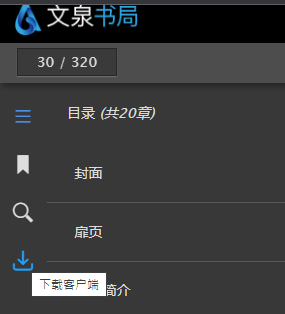</img>
</p>

客户端的简易程度令人咂舌，或者说这就是个小号的浏览器。

<p align="center">
  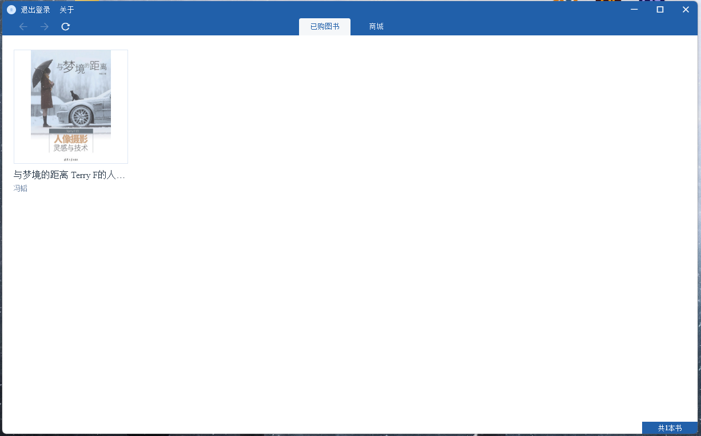</img>
</p>

## 另一个可以尝试的方向
<p align="center">
  </img>
</p>

好消息是在客户端上图书确实可以下载。点击下载，客户端会在**我的文档**下生成一个文件夹`wqshuju`，打开后`*.epc`的文件就是你下载下来的图书了。

<p align="center">
  </img>
  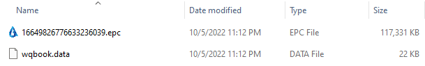</img>
</p>

可惜的是这是一个加密的文件，而我对解密这一块不是特别熟悉，但我认为不失为一个可以尝试的方向。而这个途径的取得的效果显然是优于爬虫爬取的效果的。

> 我认为原文件应该是一个加密的epub文件，有这方面经验的朋友不妨可以试试沿着这个方向接下去走走。
> 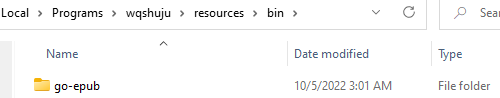

## 思路
言归正传，我的解决思路是来自于在线阅读时，文泉书局的阅读器会显示图书内容的高清图片，我们将所有页面的图片爬取下来，自己缝合成一个PDF文件就大功告成了。在开始之前，我也尝试在Github和百度上搜索过类似的项目，主要找到了[xxlllq/PDFBooks](https://github.com/xxlllq/PDFBooks)和[文泉学堂PDF(带书签)下载原理详细讲解_python脚本实现1秒1页](https://www.52pojie.cn/thread-1108776-1-1.html)两个比较有用的参考链接。但是，这些内容都是写于2020年前后，如今的文泉书局在反爬虫和API上都做了较大的改动，直接沿用是完全不可能的。
> 顺便一提，本文写于<ins>2022年10月5日</ins>，如果您看到本文的时间离这个日期已经跨度较大，那么大概率文泉书局又会做出更多更新，望考虑这个因素，酌情阅读。
> 同时，本人也**无意维持本文档的实时更新**。

总体整个解决的思路可分为以下几个步骤：**爬取每一页的高清图片** → **组合成PDF** → **爬取目录** → **在PDF中添加书签**。而整个过程中，最重要同时也是与参考材料差别最大的部分其实是第一步，所以本文只讨论爬取每一页的高清图片这个步骤，至于之后的**爬取目录**，以及**合成PDF**相对简单，大家可以参考前两文的方法或者现在主流的PDF处理软件像Acrobat及WPS都有图片转PDF的程序，界面也简单易懂，我就不过多赘述。

## 环境配置
本人使用的Windows11 + Python Anaconda虚拟环境。
不了解Anaconda的朋友，可以移步[Anaconda](https://www.anaconda.com/)，点击Download下载，然后点开exe文件安装即可。
<p align="center">
  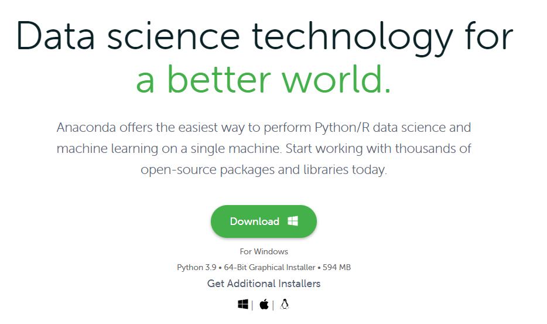</img>
</p>

安装完成后，我们直接在开始菜单搜Anaconda Power Shell Prompt打开即可。

<p align="center">
  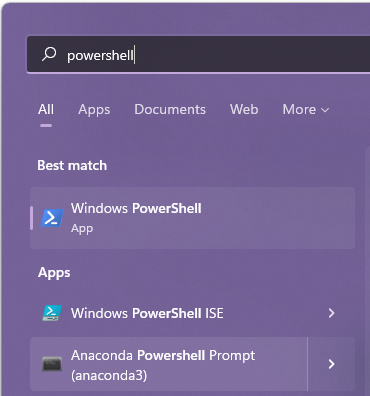</img>
  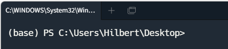</img>
</p>

打开控制台后，我们用conda create建一个虚拟环境取名pdf，然后用conda activate pdf激活环境。

```bash
$ conda create -n pdf pip python=3.7
$ conda activate pdf
```

完成后，您可以看到命令行前方的括号里变成pdf。
接下来我们开始安装需要使用的Package，首先是[Selenium](https://www.selenium.dev/)。

### Selenium + ChromeDriver
<p align="center">
  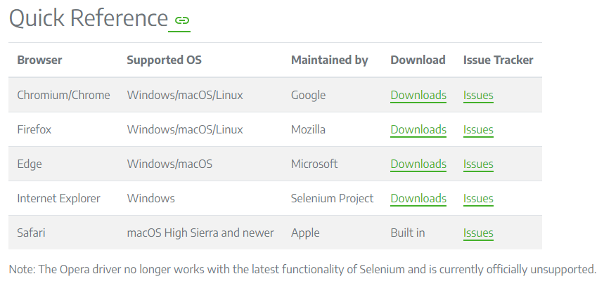</img>
</p>

Selenium要正常工作，需要您本地有对应浏览器的驱动，详情可以参考[Install Browser Drivers](https://www.selenium.dev/documentation/webdriver/getting_started/install_drivers/)。

由于我使用的是Google Chrome浏览器，所以我将演示如何安装ChromeDriver。点击图中Chrome后面的downloads，在打开的页面中根据你使用的浏览器版本，下载对应的文件。

<p align="center">
  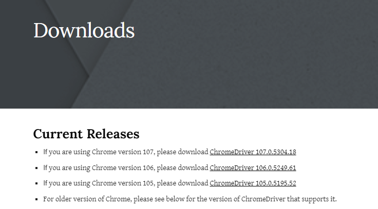</img>
</p>

我的版本是106，点开后根据你的系统下载对应的压缩包。（我是Windows，所以选择win32）

<p align="center">
  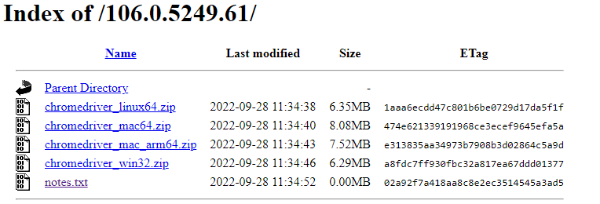</img>
</p>

将下载的压缩包中文件解压，Selenium要求这个文件**存放的目录在系统的PATH**中。

<p align="center">
  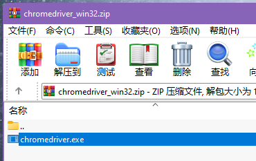</img>
</p>

### 设置PATH
<p align="center">
  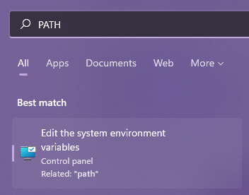</img>
</p>

点击**开始**，在搜索栏中输入`PATH`，点开第一个选项。在打开的窗口中，点击**环境变量**。

<p align="center">
  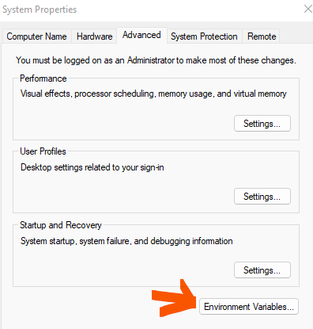</img>
</p>

在上面的表格中，找到Path，点击编辑。

<p align="center">
  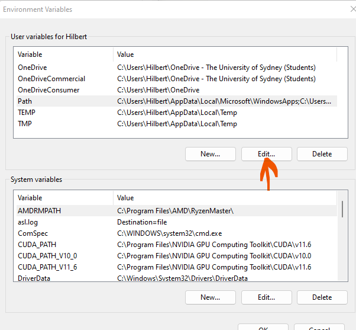</img>
</p>

点击**添加**，找到你存放chromedriver.exe的路径（建议单独找个文件夹存放）。比如，我的存放于C盘`src\webdriver`这个文件夹里。

<p align="center">
  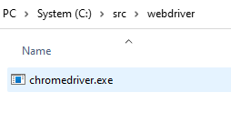</img>
</p>

点击**确认**保存更改，然后关闭窗口即可。
> **检验设置成功的方法**
>
> 打开Powershell，在命令行中直接输入chromedriver后回车，如果没有报错，证明路径已经录入PATH了。

### Selenium调用测试
在你的Anacon Powershell的工作目录（默认是你Windows系统的当前登录用户目录）下，建一个文件test.py，写入以下内容：

```python
from selenium import webdriver

driver = webdriver.Chrome('C:\\src\\webdriver\\chromedriver.exe')
driver.get('https://www.selenium.dev')
```

注意webdriver.Chrome()里写的是你chromedriver的工作路径。（双反斜杠！）

然后，在Anaconda Powershell里输入python test.py回车。

如果，你看到一个新的浏览器窗口打开，并且打开的Selenium的主页，证明Selenium能够正常调度驱动，否则，请回顾前面的流程，重新操作。

<p align="center">
  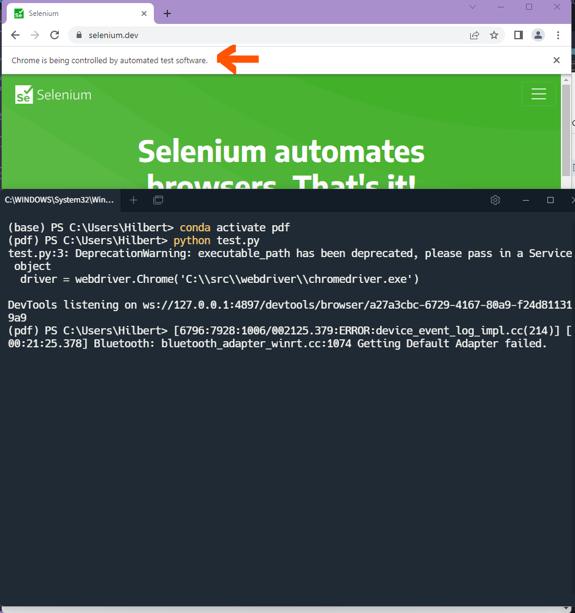</img>
</p>

> 你的浏览器窗口可能会提示你，正在被程序控制。

### [Pyautogui](https://pyautogui.readthedocs.io/en/latest/)
使用这个Package是受[Download Images Using Selenium Python With Full Code Examples](https://scripteverything.com/download-images-using-selenium-python/)的启发。这个Package可以使用程序，实现鼠标移动和点击的效果以及键盘输入。

安装方法：
在Anaconda Prompt里输入
```bash
$ pip install pyautogui
```
即可

## 登录
首先，在阅读器的界面，我们打开浏览器的Inspector。没有登录时，发现页面最多只能加载到第30页。
<p align="center">
  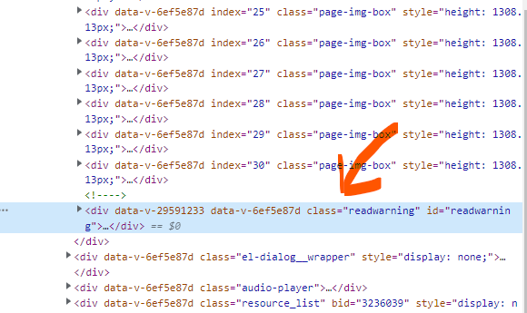</img>
</p>

而在登录之后，就能正常加载。

<p align="center">
  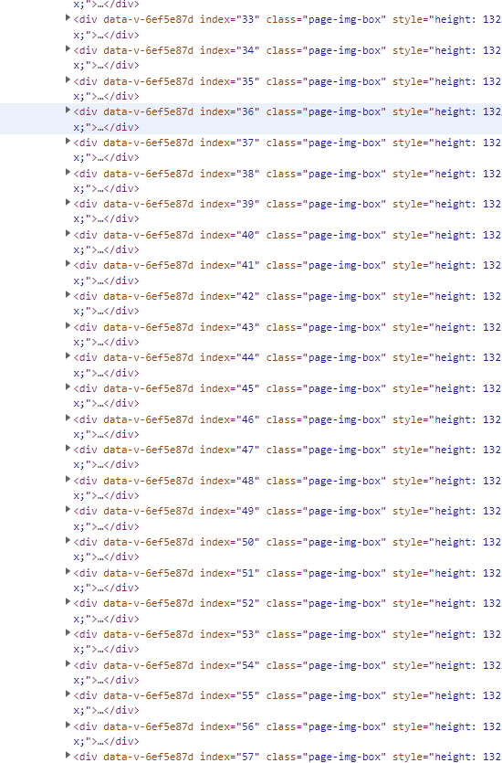</img>
</p>

因为，Selenium运行的时候会打开一个全新的浏览器窗口，而cookie和session的数据都是没有的，所以我们需要先让新的窗口登录。相比于去解析文泉书局的登录request，我选择更加简单的方法就是模拟一个真实的用户，点击浏览器的右上角登录。

<p align="center">
  </img>
</p>

因为，我使用的是微信登录，所以点了登录之后，我们需要在之后的页面再点击微信的图标。

<p align="center">
  </img>
</p>

点击图标之后会打开一个二维码界面，让我们扫描。而对于代码来说，我们只需要使用time.sleep()（我设置默认等60秒）等待一段时间扫码即可。

```python
def wechat_signin(driver, wait_time=60):
    '''
    wait_time: how long the driver waits at the QR code scanning page
    '''
    signin = driver.find_element(by=By.XPATH, value='//*[@id="app"]/header/div[2]/span[2]')
    signin.click()
    time.sleep(1)

    wechat = driver.find_element(by=By.XPATH, value='/html/body/app-root/app-login/div/div/div[2]/div[3]/div[2]/img[1]')
    wechat.click()
    time.sleep(wait_time)
```

## 生成PDF
开头，已经说了之后的部分我不过多赘述，我生成PDF的代码都在gen_pdf.py里，大家感兴趣可以自行参考。

## References引用
* [xxlllq/PDFBooks](https://github.com/xxlllq/PDFBooks)
* [文泉学堂PDF(带书签)下载原理详细讲解_python脚本实现1秒1页](https://www.52pojie.cn/thread-1108776-1-1.html)
* [Download Images Using Selenium Python With Full Code Examples](https://scripteverything.com/download-images-using-selenium-python/)
