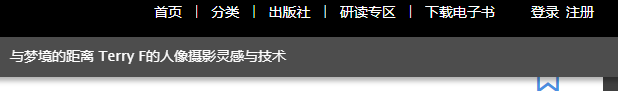

# 文泉书局电子书PDF下载

本人<b style="color: red">从未以任何形式鼓励盗版</b>，本教程旨在分享技术，**供个人参考学习，切勿用于任何获利途径，转载请署名原作者**。本教程使用的书，为个人购买，也**只面向已购买文泉书局版权内容的用户参考**。

## 前言
<p align="center">
  </img>
</p>

契机是本人非常喜欢的一位摄影师 [@Terry-F](https://space.bilibili.com/98668543) 老师出了一本书，我第一时间入了实体书但是后面因为一个做摄影的朋友过生日，就被我当成礼物送了出去。因为自己还没有拜读，但是想着再买一本实体书有点蠢，而且近几年我的大部分工作都步入无纸化（Apple Pencil+IPad确实香），就想着入个电子版在IPad上看。然后就来到了我们的主题，我在文泉书局上找到了电子版的销售链接，没有多想的付款了，谁知道这个电子版竟然只能在线看。点击下载，按照网站的引导下载了客户端，确实可以下载了（或者叫“缓存” lmao），但是也仍然只有文泉书局的客户端能打得开，更别提导入平板电脑了。
我在大学，也陆陆续续在各大线上图书馆买个各种各样的电子书，我倒是第一次见到，购买后只能线上阅读的网站。作为一个技术人，我还是希望能通过技术手段，让自己在平板上拜读老师作品的愿望能够成真。
<p align="center">
  </img>
</p>

客户端的简易程度令人咂舌，或者说这就是个小号的浏览器。

<p align="center">
  </img>
</p>

## 另一个可以尝试的方向
<p align="center">
  </img>
</p>

好消息是在客户端上图书确实可以下载。点击下载，客户端会在**我的文档**下生成一个文件夹`wqshuju`，打开后`*.epc`的文件就是你下载下来的图书了。

<p align="center">
  </img>
  </img>
</p>

可惜的是这是一个加密的文件，而我对解密这一块不是特别熟悉，但我认为不失为一个可以尝试的方向。而这个途径的取得的效果显然是优于爬虫爬取的效果的。

> 我认为原文件应该是一个加密的epub文件，有这方面经验的朋友不妨可以试试沿着这个方向接下去走走。
> 

## 思路
言归正传，我的解决思路是来自于在线阅读时，文泉书局的阅读器会显示图书内容的高清图片，我们将所有页面的图片爬取下来，自己缝合成一个PDF文件就大功告成了。在开始之前，我也尝试在Github和百度上搜索过类似的项目，主要找到了[xxlllq/PDFBooks](https://github.com/xxlllq/PDFBooks)和[文泉学堂PDF(带书签)下载原理详细讲解_python脚本实现1秒1页](https://www.52pojie.cn/thread-1108776-1-1.html)两个比较有用的参考链接。但是，这些内容都是写于2020年前后，如今的文泉书局在反爬虫和API上都做了较大的改动，直接沿用是完全不可能的。
> 顺便一提，本文写于<ins>2022年10月5日</ins>，如果您看到本文的时间离这个日期已经跨度较大，那么大概率文泉书局又会做出更多更新，望考虑这个因素，酌情阅读。
> 同时，本人也**无意维持本文档的实时更新**。

总体整个解决的思路可分为以下几个步骤：**爬取每一页的高清图片** → **组合成PDF** → **爬取目录** → **在PDF中添加书签**。而整个过程中，最重要同时也是与参考材料差别最大的部分其实是第一步，所以本文只讨论爬取每一页的高清图片这个步骤，至于之后的**爬取目录**，以及**合成PDF**相对简单，大家可以参考前两文的方法或者现在主流的PDF处理软件像Acrobat及WPS都有图片转PDF的程序，界面也简单易懂，我就不过多赘述。

## 环境配置
本人使用的Windows11 + Python Anaconda虚拟环境。
不了解Anaconda的朋友，可以移步[Anaconda](https://www.anaconda.com/)，点击Download下载，然后点开exe文件安装即可。
<p align="center">
  </img>
</p>

安装完成后，我们直接在开始菜单搜Anaconda Power Shell Prompt打开即可。

<p align="center">
  </img>
  </img>
</p>

打开控制台后，我们用conda create建一个虚拟环境取名pdf，然后用conda activate pdf激活环境。

```bash
$ conda create -n pdf pip python=3.7
$ conda activate pdf
```

完成后，您可以看到命令行前方的括号里变成pdf。
接下来我们开始安装需要使用的Package，首先是[Selenium](https://www.selenium.dev/)。

### Selenium + ChromeDriver
<p align="center">
  </img>
</p>

Selenium要正常工作，需要您本地有对应浏览器的驱动，详情可以参考[Install Browser Drivers](https://www.selenium.dev/documentation/webdriver/getting_started/install_drivers/)。

由于我使用的是Google Chrome浏览器，所以我将演示如何安装ChromeDriver。点击图中Chrome后面的downloads，在打开的页面中根据你使用的浏览器版本，下载对应的文件。

<p align="center">
  </img>
</p>

我的版本是106，点开后根据你的系统下载对应的压缩包。（我是Windows，所以选择win32）

<p align="center">
  </img>
</p>

将下载的压缩包中文件解压，Selenium要求这个文件**存放的目录在系统的PATH**中。

<p align="center">
  </img>
</p>

### 设置PATH
<p align="center">
  </img>
</p>

点击**开始**，在搜索栏中输入`PATH`，点开第一个选项。在打开的窗口中，点击**环境变量**。

<p align="center">
  </img>
</p>

在上面的表格中，找到Path，点击编辑。

<p align="center">
  </img>
</p>

点击**添加**，找到你存放chromedriver.exe的路径（建议单独找个文件夹存放）。比如，我的存放于C盘`src\webdriver`这个文件夹里。

<p align="center">
  </img>
</p>

点击**确认**保存更改，然后关闭窗口即可。
> **检验设置成功的方法**
>
> 打开Powershell，在命令行中直接输入chromedriver后回车，如果没有报错，证明路径已经录入PATH了。

### Selenium调用测试
在你的Anacon Powershell的工作目录（默认是你Windows系统的当前登录用户目录）下，建一个文件test.py，写入以下内容：

```python
from selenium import webdriver

driver = webdriver.Chrome('C:\\src\\webdriver\\chromedriver.exe')
driver.get('https://www.selenium.dev')
```

注意webdriver.Chrome()里写的是你chromedriver的工作路径。（双反斜杠！）

然后，在Anaconda Powershell里输入python test.py回车。

如果，你看到一个新的浏览器窗口打开，并且打开的Selenium的主页，证明Selenium能够正常调度驱动，否则，请回顾前面的流程，重新操作。

<p align="center">
  </img>
</p>

> 你的浏览器窗口可能会提示你，正在被程序控制。

### [Pyautogui](https://pyautogui.readthedocs.io/en/latest/)
使用这个Package是受[Download Images Using Selenium Python With Full Code Examples](https://scripteverything.com/download-images-using-selenium-python/)的启发。这个Package可以使用程序，实现鼠标移动和点击的效果以及键盘输入。

安装方法：
在Anaconda Prompt里输入
```bash
$ pip install pyautogui
```
即可

## 登录
首先，在阅读器的界面，我们打开浏览器的Inspector。没有登录时，发现页面最多只能加载到第30页。
<p align="center">
  </img>
</p>

而在登录之后，就能正常加载。

<p align="center">
  </img>
</p>

因为，Selenium运行的时候会打开一个全新的浏览器窗口，而cookie和session的数据都是没有的，所以我们需要先让新的窗口登录。相比于去解析文泉书局的登录request，我选择更加简单的方法就是模拟一个真实的用户，点击浏览器的右上角登录。

<p align="center">
  </img>
</p>

因为，我使用的是微信登录，所以点了登录之后，我们需要在之后的页面再点击微信的图标。

<p align="center">
  </img>
</p>

点击图标之后会打开一个二维码界面，让我们扫描。而对于代码来说，我们只需要使用`time.sleep()`（我设置默认等60秒）等待一段时间扫码即可。

```python
def wechat_signin(driver, wait_time=60):
    '''
    wait_time: 等待用户扫描二维码的时间。
    '''
    signin = driver.find_element(by=By.XPATH, value='//*[@id="app"]/header/div[2]/span[2]')
    signin.click()
    time.sleep(1)

    wechat = driver.find_element(by=By.XPATH, value='/html/body/app-root/app-login/div/div/div[2]/div[3]/div[2]/img[1]')
    wechat.click()
    time.sleep(wait_time)
```
> 定位按钮的位置，我使用的XPATH。
>
> 你只需要在Inspector里找到按钮的元素，右键复制XPATH粘贴到`value`里即可。
> 

## 机制分析
接下来，就是重头戏——爬取高清的图片。但是，在介绍方法之前，我们先来看一下文泉书局阅读器的机制。

### 1. 高清图片加载
首先，只有我们的鼠标滚轮滚到对应的页码，那一页的内容才会显示高清的图片。否则，则以缩略图存在。
<p align="center">
  </img>
</p>

> 如图，我们这第七页时，`page-lmg`这个`<div>`下才有图片。而第十三页则是一个空的container。

### 2. 图片分割
对比之前参考文章的描述，这个特征是文泉书局最近更新的反下载策略。

每一个高清页并不是以一张图片的形式存在的，比如案例的图书，被等分成了六份，而且是乱序的摆放的（第一个``对应的并不是第一等分）。
> 一页的完整尺寸是1440x2026，但被分成了6个240x2026的部分。

同时，我们直接通过`src`里的链接去获取原图，会被拒绝访问。（后台应该只允许获取一次）
<p align="center">
  </img>
</p>

但是，我们可以对图片右键另存为，将图片保存！

<p align="center">
  </img>
  </img>
  </img>
  </img>
</p>

保存下来的，的的确确是高清的webg图片。

## 解决途径
根据以上观察，我构思了这样一个解决方案：**跳转到页数n（保证高清图片的加载）** ⇒ **获取每个细分图片的信息，并排序** ⇒ **按照顺序对每个细分图片进行右键保存的操作** ⇒ **跳转到下一页**。

本部分所有代码来自于`download.py`这个文件，对于这个文件你只需修改第九到十一行即可使用：
```python
PAGES = int #书的总页数
ADDRESS = str #书的网址
driver = webdriver.Chrome(str) #括号内写你的chromedriver.exe所在的位置
```
> 在Anaconda Powershell里输`python download.py`即可运行。

### 跳转到页数n
```python
pages = driver.find_elements(by=By.CLASS_NAME, value='page-img-box')

def go_to_page_n(driver, n):
    '''
    使用鼠标滚轮跳转到对应页数。
    '''
    ActionChains(driver)\
        .scroll_to_element(pages[n])\
        .perform()
```
这里我们使用了Selenium里的Actions API里的[滚轮操作](https://selenium.dev/documentation/webdriver/actions_api/wheel/#scroll-to-element)。（在阅读器里，鼠标滚轮的滚动实现了翻页。而每一页的container都对应了`page-img-box`这个class）

### 排序
<p align="center">
  </img>
</p>

细看每一个细分的图片，我们可以发现哪怕它们是乱序的，但是每一个``的`left`的值其实就暴露了排列的先后，所以我们可以根据每一个`left`的值的大小，来获得保存顺序。

我仅使用了一个随手写的排序算法（O(n^2）效率显然不好，但对于我的目的而言绰绰有余了）。最后，将整理结果存在`order`这个list里。

```python
# 将每一个细分图片找到，统一存在pieces这个list里
img = pages[page].find_element(by=By.CLASS_NAME, value='page-lmg')
pieces = img.find_elements(by=By.TAG_NAME, value='img')

# 根据“left"的css值来排序
order = []
row = []
for piece in pieces:
    row.append(float(piece.value_of_css_property('left')[:-2]))

while len(order) != len(row):
    for n in range(len(row)):
        if n not in order:
            mini = row[n]

    i = 0
    while i < len(row):
        if row[i] < mini and i not in order:
            mini = row[i]
        i += 1
    # 找到最小
    order.append(row.index(mini))
```
### 下载
下载部分，由于源地址无法第二次访问使得之前那些文章的方法全部失效。而我采用的解决方法是，用程序模拟真人的右键保存操作。

我们这次使用Selenium Actions API里的[鼠标右键操作](https://www.selenium.dev/documentation/webdriver/actions_api/mouse/#context-click)定位到对应的细分图片并点击右键。由于，Selenium仅仅只能控制浏览器的部分，所以之后的操作我们需要借助Pyautogui的帮助，对于另存为来说，我们在右键之后只需按键盘的方向下键两次，再敲两次回车即可将图片保存到我们默认的保存位置（你当然可以修改代码，添加更复杂的操作来修改下载路径，但是我认为全部下载完后统一转移更省事）。

<p align="center">
  </img>
</p>

```python
def right_click_save_as(segment):
    '''
    segment: 我们想另存为所对应的
    '''
    ActionChains(driver)\
        .context_click(segment)\
        .perform()

    pyautogui.typewrite(['down', 'down', 'enter', 'enter'], interval=0.5) #键盘输入下，下，回车，回车
    time.sleep(0.5)
```

## 合并大图
本部分代码全部存于`merge.py`文件中。

对于图片合并，我们使用[Pillow](https://pillow.readthedocs.io/en/stable/index.html)这个Package。在Anaconda命令行中输入`conda install pillow`来安装。

我将前一部分下载下来的子图全部移动到`merge.py`所在目录下的`temp`文件夹。

<p align="center">
  </img>
</p>

爬下来的图会有以下特征，默认另存为的文件名是该图片所对应的页数，又因为是六等分，所以Windows会自动在文件名后面添加序号。所以，合并图片我们从左到右的顺序应该是：

<p align="center">
  </img>
</p>

直接在命令行中运行`python merge.py`即可。

对于`merge.py`你只需修改第三到五行：
```python
PAGES = 320 #总页数
SPLIT = 6 #等分数
sub_image_dir = 'temp/' #爬下的子图所在的文件夹路径
```
运行完成后，你就获得了一页页完整的图片啦！
<p align="center">
  </img>
</p>

## 生成PDF
开头已经说了之后的部分我不过多赘述，我生成PDF的代码都在`gen_pdf.py`里，大家感兴趣可以自行参考。

## References引用
* [xxlllq/PDFBooks](https://github.com/xxlllq/PDFBooks)
* [文泉学堂PDF(带书签)下载原理详细讲解_python脚本实现1秒1页](https://www.52pojie.cn/thread-1108776-1-1.html)
* [Download Images Using Selenium Python With Full Code Examples](https://scripteverything.com/download-images-using-selenium-python/)
